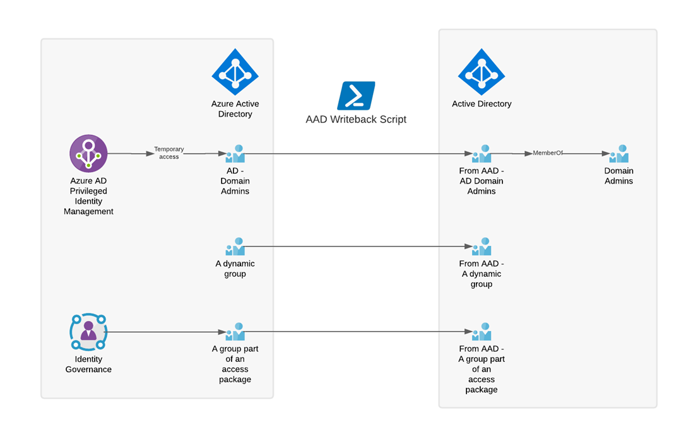
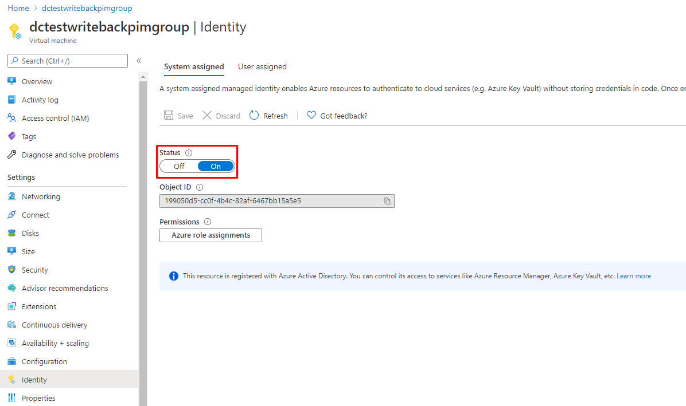

# AAD Group Writeback Script

This repository contains a script that can take certain groups in an Azure Active Directory, defined by a scope, writing them back to onpremises Active Directory, including group memberships.



## Use cases

- Use the Azure AD Privileged Groups functionality to control AD group memberships with Azure AD Privileged Identity Management (PIM), effectively being a replacement for MIM PAM
- Use the Azure AD dynamic group functionality to dynamically assign group memberships in AD
- Use the Azure AD Entitlement Management functionality to enable users to request access packages that provides AD group memberships
- Use the Microsoft 365 Groups functionality to delegate group management, writing these groups back to AD to provide functionlity

## Setup

- Make sure that you are running Azure AD Connect 1.1.553.0 or newer (it came out in 2017, so shame on you if you are not)
- Download or clone this repository into a folder on one of your servers
  - Because this script will handle groups that have high privilege, you should put this script on a "Tier 0" type server, such as a domain controller og your Azure AD Connect server.
- Install the Active Directory PowerShell module 

```
Install-WindowsFeature RSAT-AD-PowerShell
```
- Configure authentication (See section 'Authenticating to Azure AD')
  - I would recommend running this on the server, as the user that will be running the script on a scheduled task.
- Define all configuration parameters (See section 'Configuration' or example configurations)
- Run the Run.ps1 file as per the section 'Invocation', with -WhatIf:$true
  - This will show you what the script wants to do, without the script actually making any changes to AD
- Run the Run.ps1 file as per the section 'Invocation', **without** -WhatIf:$true. Now the script will write-back your groups.
- Add the Run.ps1 script to a scheduled task

## Invocation

The script is invoked using Run.ps1, with the ConfigFile parameter. If Run.ps1 is run without parameter, "Run.config" is the default value.

### Normal invocation

Run.config will be used.

```
.\Run.ps1 -Verbose
```

### Normal invocation defining config file as parameter

```
.\Run.ps1 -ConfigFile Config.config -Verbose
```

### Multiple config files

The following can be useful if you have multple Azure ADs or limitations in scoping. Remember that the script should then have one destionation OU per config file in order for deletion to work properly.

```
"Tenant1.config","Tenant2.config","Tenant3.config" | .\Run.ps1 -Verbose
```

## Configuration

| Configuration option        | Required? | Description                                                 | Valid values                        |
| --------------------------- | --------- | ----------------------------------------------------------- | ----------------------------------- |
| AuthenticationMethod        | Yes       |                                                             | MSI / ClientCredentials             |
| ClientID                    | 1         | The clientid used for the Client Credential Grant           | A guid                              |
| EncryptedSecret             | 1         | The client secret used for the Client Credential Grant      | Any string                          |
| TenantID                    | 1         | The tenantid used for the Client Credential Grant           | A guid                              |
| DestinationOU               | Yes       | The OU where groups will be created                         | OU=Groups,DC=contoso,DC=com         |
| ADGroupObjectIDAttribute    | Yes       | The AD attribute for source anchor (objectid of AAD group)  | A string attribute in AD (info, description, extensionAttribute1, etc) |
| AADGroupScopingMethod       | Yes       | The method of determining which AAD groups to sync          | Filter / GroupMemberOfGroup / PrivilegedGroups |
| AADGroupScopingConfig       | 2         | Additional info required to determine groups (filter etc.)  | id eq '<objectid>'                  |
| GroupDeprovisioningMethod   | Yes       | Determines what to do when source AAD group is deleted      | Delete / ConvertToDistributionGroup / PrintWarning / DoNothing |
| ADGroupNamePattern          | No        | Format string for AD group name, {0} = displayName from AAD, {1} = objectId from AAD, {2} = mailNickname from AAD | {0} ({1}) |
| Environment                 | No        | Azure Environment (default to AzurePublic)                  | AzureCloud / AzureUSGovernment	    |
| TransitiveMembers           | No        | Retrieves a flat list of members from all child groups of the AAD group | true                    |

1. If AuthenticationMethod is ClientCredentials
2. If AADGroupScopingMethod is GroupMemberOfGroup or AADGroupScopingConfig

### Example configurations

The configuration file is a JSON based, and contains a dictionary with key-value pairs. There are three example configuration files provided:

| File | Description |
| - | - |
| Example1.config | Using client credentials to authenticate to Azure AD, writing all privileged groups back to AD. If groups are deleted from Azure AD, a list of warnings are printed. |
| Example2.config | Using Managed Service Identity to authenticate to Azure AD, writing a filtered list of groups back to AD. If groups are deleted from Azure AD, the AD group will be converted to a distribution group (which does not give any access, and is an effective disable method). |
| Example3.config | Using Managed Service Identity to authenticate to Azure AD, writing all groups that are member of the group '5f7ab793-e722-435a-a8bf-ac48a3f7361e' back to AD. If groups are deleted from Azure AD, the AD group will be deleted. |

## Authenticating to Azure AD

There are two supported methods to authenticate to Azure AD - MSI and Client Credentials.

### Managed Service Identity (MSI)

If you are running the write-back script on a virtual machine in Azure, that is running in a subscription that is connected to your Azure AD tenant, you simples option is to enable MSI for your VM. 

1. On your Virtual Machine in Azure, find "Identity" and enable System Assigned Managed Identity



2. Copy the ObjectID, and run the following to grant Group.Read.All access to the MSI:

```
$ObjectID = "<guid>"

# No need to edit below this line, just run
Install-Module AzureAD
Connect-AzureAD
$graph = Get-AzureADServicePrincipal -Filter "AppId eq '00000003-0000-0000-c000-000000000000'" 
$groupReadAll = $graph.AppRoles | ? Value -eq "Group.Read.All"
New-AzureADServiceAppRoleAssignment -Id $groupReadAll.Id -PrincipalId $ObjectId -ResourceId $graph.ObjectId -ObjectID $ObjectID
$userReadAll = $graph.AppRoles | ? Value -eq "User.Read.All"
New-AzureADServiceAppRoleAssignment -Id $userReadAll.Id -PrincipalId $ObjectId -ResourceId $graph.ObjectId -ObjectID $ObjectID
```

Now, in your config file, set AuthenticationMethod to "MSI". No need to provide ClientID, TenantID or EncryptedSecret.

### Client Credentials

If you cannot use MSI, this is the way to go.

1. Register an app registration in your tenant using Azure AD PowerShell Module (You can change the app name)

Make sure to run this in the context of the same user, as the same computer you will be running the write-back script on. This is due to the secure string handling :)

```PowerShell
function New-WriteBackScriptInstallation {
    [CmdletBinding()]

    Param
    (
        [Parameter(Mandatory=$false,
                   Position=0)]
        $ConfigFile = ".\Run.config"
    )

    $appName = "AzureAD to AD group writeback script"

    Install-Module AzureAD | Out-Null
    Connect-AzureAD | Out-Null

    $requiredGrants = [Microsoft.Open.AzureAD.Model.RequiredResourceAccess]::new(
        "00000003-0000-0000-c000-000000000000", # Microsoft Graph
        @(
            [Microsoft.Open.AzureAD.Model.ResourceAccess]::new("5b567255-7703-4780-807c-7be8301ae99b","Role") 
            [Microsoft.Open.AzureAD.Model.ResourceAccess]::new("df021288-bdef-4463-88db-98f22de89214","Role") 
        )
    )

    Write-Verbose "[Change] Creating the app registration '$appName'" -Verbose
    $app = New-AzureADApplication -DisplayName $appName -RequiredResourceAccess $requiredGrants
    $sp = New-AzureADServicePrincipal -AppId $app.appid
    $key = New-AzureADApplicationPasswordCredential -ObjectId $app.ObjectId -EndDate (get-date).AddYears(100)

    $url = "https://portal.azure.com/#blade/Microsoft_AAD_RegisteredApps/ApplicationMenuBlade/CallAnAPI/appId/$($app.AppId)/isMSAApp/"
    Write-Verbose "Go to the url that already is put on the clipboard and click 'Grant admin consent':`n`n$url" -Verbose
    $url | Set-Clipboard
    Read-host -Prompt "Click enter when done"

    if(Test-Path $ConfigFile) {
        $ConfigFile2 = ".\{0}.config" -f [guid]::NewGuid()
        Write-Verbose "File $ConfigFile already exists, writing to $ConfigFile2"
        $ConfigFile = $ConfigFile2
    }

    $_config = [ordered] @{
        AuthenticationMethod = "ClientCredentials"
        ClientID = $app.appid
        EncryptedSecret = "$($key.Value | ConvertTo-SecureString -AsPlainText -Force | ConvertFrom-SecureString)"
        TenantID = "$((Get-AzureADCurrentSessionInfo).TenantId.ToString())"
        DestinationOU = "OU=AAD Group writeback,DC=contoso,DC=com"
        ADGroupObjectIDAttribute = "info"
        AADGroupScopingMethod = "PrivilegedGroups"
        GroupDeprovisioningMethod = "PrintWarning"
    } | ConvertTo-Json
    set-content $ConfigFile -Value $_config

    Write-Host "Created file $ConfigFile"
}
New-WriteBackScriptInstallation
```

2. After granting admin consent as per the instructions from the script. Populate the four config settings below with the values from the script:

  - AuthenticationMethod
  - ClientID
  - EncryptedSecret
  - TenantID


## Possible future release?

PAM bastion forest support using the AD optional feature for PAM and msDS-ShadowPrincipal object types with support for time limited memberships. 

```
$of = get-ADOptionalFeature -filter "name -eq 'privileged access management feature'"
Enable-ADOptionalFeature $of -scope ForestOrConfigurationSet -target ((Get-ADForest).RootDomain)
```
